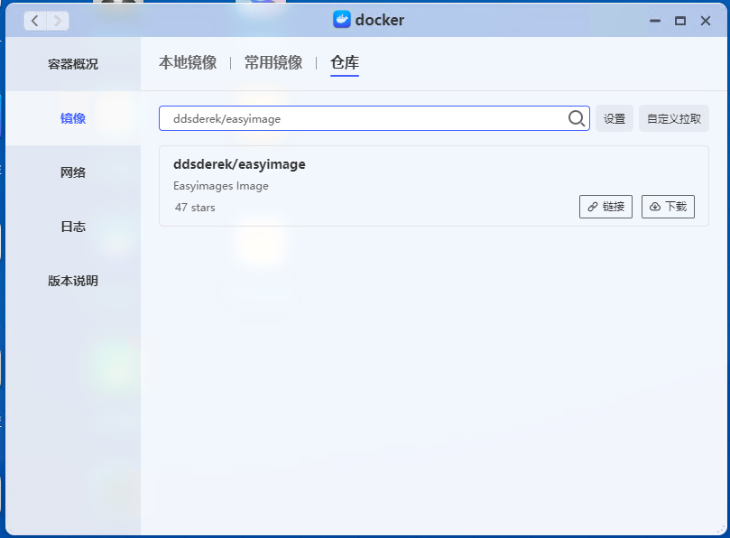
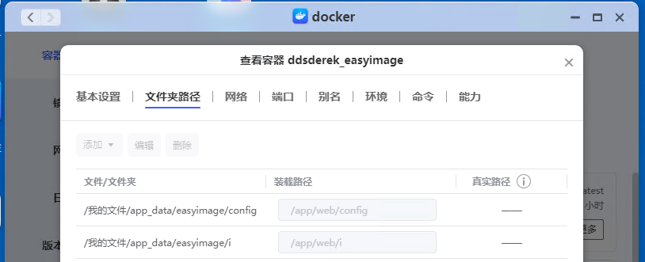
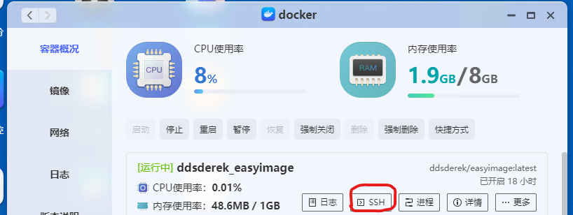
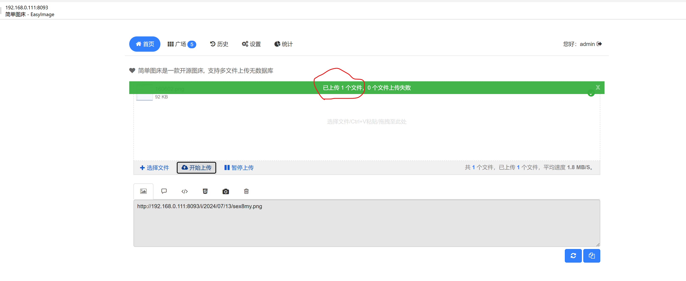
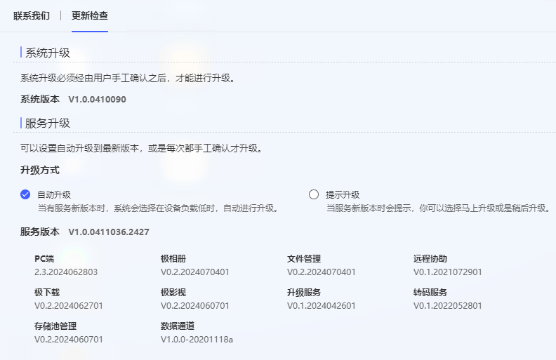

# easyimage-docker

>环境信息说放在最后说明

easyimage部署(极空间docker)

### 步骤
1. 下载docker镜像(如果因网络问题下载失败，尝试本地导入镜像)

2. 启动容器

网络配置一个不冲突的本地端口，例如：8093
3. 初始化设置
登录http://your.host:8093

注册用户

4. 修改目录权限

chmod 777 /tmp

5. 上传文件测试

大功告成！！！

至此图床服务部署已经完成，如果配合编辑器插件使用可实现图片自动上传云端并生成url，生产力可以进一步提升，相关内容后续补充。

### 环境说明

docker version: V2.2

easyimage version: v2.8.5

